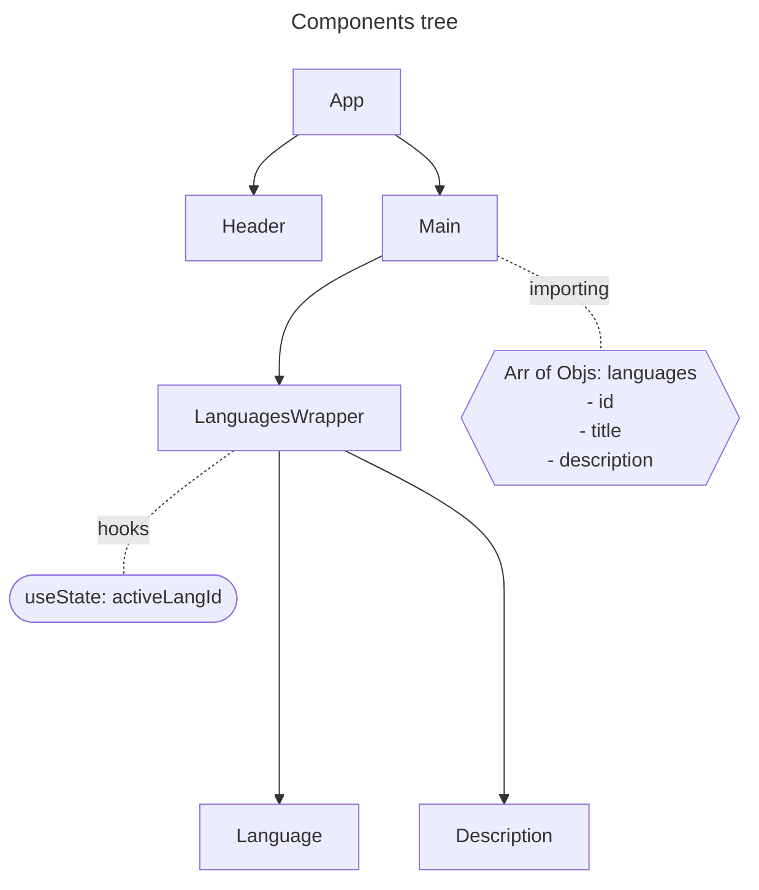

# React + Vite

```mermaid
---
title: Components tree
---
graph TD
    App --> Header
    App --> Main
    Main -->LanguagesWrapper
    LanguagesWrapper -----> Language
    LanguagesWrapper -----> Description

    Main -. importing .- data
    LanguagesWrapper -. hooks .- states

data{{"Arr of Objs: languages
    - id
    - title
    - description"}}
states([useState: activeLangId])
```

